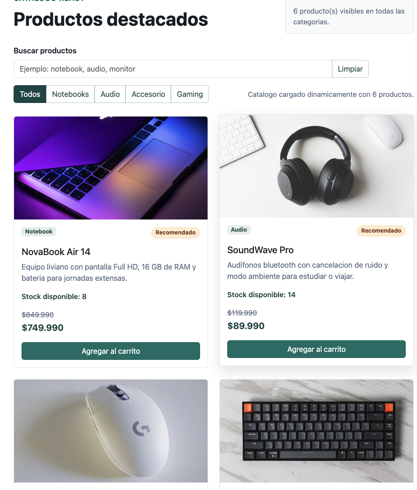
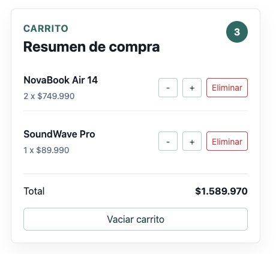
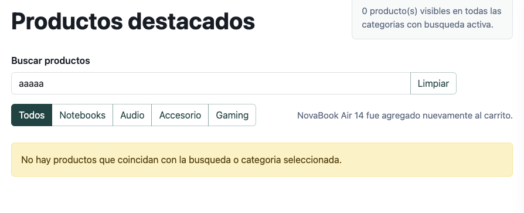
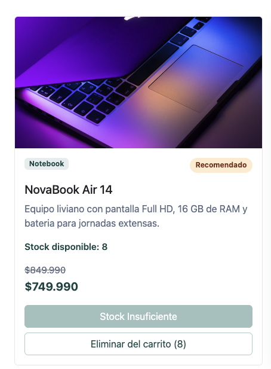
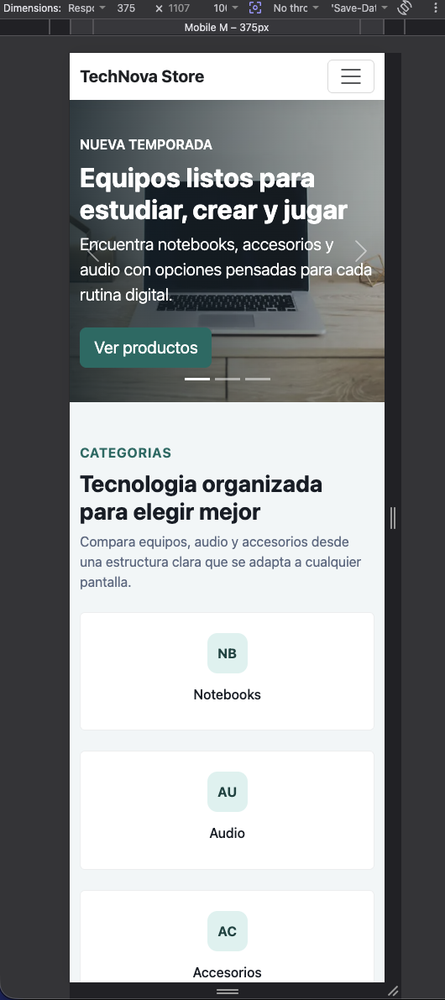

# TechNova Store

Actividad sumativa de la Semana 8 para Desarrollo Frontend I. El proyecto implementa un eCommerce en React con carga dinamica de productos, gestion de carrito y renderizado condicional.

## Descripcion

TechNova Store presenta un catalogo de productos tecnologicos cargado desde `public/data/products.json` mediante `useEffect`. La interfaz permite buscar y filtrar productos, agregar o eliminar unidades del carrito, controlar stock disponible y visualizar el total de compra.

## Tecnologias utilizadas

- React
- Vite
- Bootstrap 5
- CSS3
- JSON local
- React Loading Skeleton
- GitHub Pages

## Funcionalidades principales

- Componentes funcionales separados por responsabilidad.
- Carga dinamica del catalogo con `useEffect` y `fetch`.
- Estado del catalogo, carrito, busqueda, categoria, carga y error con `useState`.
- Skeleton loading mientras se cargan los productos para evitar saltos visuales.
- Busqueda instantanea por nombre, categoria o descripcion.
- Filtros por categoria.
- Carrito de compras con agregar, restar, eliminar y vaciar productos.
- Validacion de stock para evitar agregar mas unidades de las disponibles.
- Mensaje `Stock Insuficiente` cuando el producto ya alcanzo el maximo disponible en el carrito.
- Renderizado condicional para carga, error, busqueda sin resultados, carrito vacio, productos agregados y stock insuficiente.
- Rutas de imagenes compatibles con despliegue en GitHub Pages.

## Estructura del proyecto

```text
Desarrollo_Frontend_I_Exp3/
├── public/
│   ├── assets/
│   │   └── img/
│   └── data/
│       └── products.json
├── screenshots/
├── src/
│   ├── components/
│   ├── utils/
│   ├── App.jsx
│   ├── main.jsx
│   └── styles.css
├── index.html
├── package.json
├── vite.config.js
└── README.md
```

## Como ejecutar el proyecto

Instala dependencias:

```bash
npm install
```

Ejecuta el servidor local:

```bash
npm run dev
```

Genera una version de produccion:

```bash
npm run build
```

## Evidencias para entrega

Las siguientes capturas deben agregarse en la carpeta `screenshots/` antes de entregar en AVA.

### Catalogo cargado dinamicamente



### Carrito funcionando



### Renderizado condicional sin resultados



### Stock insuficiente



### Vista responsive



## Publicacion

El proyecto esta preparado para GitHub Pages con:

- `base: '/Desarrollo_Frontend_I_Exp3/'` en `vite.config.js`
- script `deploy` con `gh-pages -d dist`

Para publicar:

```bash
npm run build
npm run deploy
```

Repositorio GitHub:

```text
https://github.com/Arekkusu17/Desarrollo_Frontend_I_Exp3
```

Sitio publicado:

```text
https://arekkusu17.github.io/Desarrollo_Frontend_I_Exp3/
```
